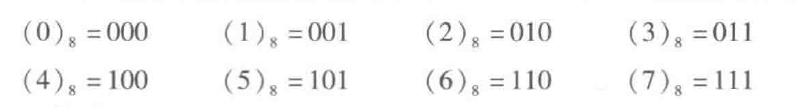
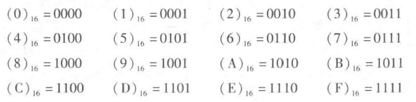
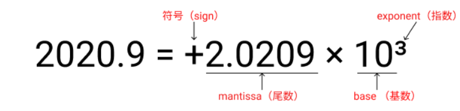

## 信息的二进制编码

在计算机系统内部，所有信息都是用二进制进行编码的。也就是说计算机内部采用的是二进制表示方式。这样做的原因有以下几点:
- 二进制只有两种基本状态，使用有两个稳定状态的物理器件就可以表示二进制数的每一位，而制造有两个稳定状态的物理器件要比制造有多个稳定状态的物理器件容易得多。例如，用高、低两个电位，或用脉冲的有无、脉冲的正负极性等都可以很方便、很可靠地表示“0”和“1”
- 二进制的编码、计数和运算规则都很简单，可用开关电路实现，简便易行
- 两个符号“1”和“0”正好与逻辑命题的两个值“真”和“假”相对应，为计算机中实现逻辑运算和程序中的逻辑判断提供了便利的条件，特别是能通过逻辑门电路方便地实现算术运算

采用二进制编码将各种媒体信息转变成数字化信息后，可以在计算机内部进行存储、运算和传送。在高级语言程序设计中，可以利用图、树、表和队列等数据结构进行算法描述，并以数组、结构、指针和字符串等数据类型来说明处理对象，但将高级语言程序转换为机器语言程序后，每条机器指令的操作数就只能是以下4种简单的基本数据类型：无符号定点整数、带符号定点整数、浮点数和非数值型数据(位串):

指令所处理的数据类型分为数值数据和非数值数据两种。数值数据可用来表示数量的多少，可比较其大小，分为整数和实数，整数又分为无符号整数和带符号整数。在计算机内部，整数用定点数表示，实数用浮点数表示。非数值数据就是一个没有大小之分的位串，不表示数量的多少，主要用来表示字符数据和逻辑数据。

在计算机内部，数值数据的表示方法有两大类：第一种是直接用二进制数表示；另一种是采用二进制编码的十进制数(Binary Coded Decimal Number，简称BCD)表示。表示一个数值数据要确定三个要素：进位计数制、定/浮点表示和编码规则。任何给定的一个二进制 0/1 序列，在未确定它采用什么进位计数制、定点还是浮点表示以及编码表示方法之前，它所代表的数值数据的值是无法确定的。

## 进位计数制
十进制数，其每个数位可用10个不同符号0，1，2，...，9来表示，每个符号处在十进制数中不同位置时，所代表的数值不一样。例如，2585.62代表的值是：

$$
(2585.62)_{10} = 2 \times 10^3 + 5 \times 10^2 + 8 \times 10^1 + 5 \times 10^0 + 6 \times 10^{-1} + 2 \times 10^{-2}
$$

类似地，二进制数的基数是 2，只使用两个不同的数字符号 0 和 1，运算时采用“逢二进一”的规则，例如，二进制数 $(100101.01)_2$ 代表的值是:

$$
(100101.01)_2 = 1 \times 2^5 + 0 \times 2^4 + 0 \times 2^3 + 1 \times 2^2 + 0 \times 2^1 + 1 \times 2^0 + 0 \times 2^{-1} + 1 \times 2^{-2} = (37.25)_{10}
$$

扩展到一般情况，在 R 进制数字系统中，应采用R个基本符号 (0, 1, ..., R-1) 表示各位上的数字，采用“逢R进一”的运算规则，对于每一个数位，该位上的权为 $R^i$。R 被称为该数字系统的基:

- 二进制R=2，基本符号为 0 和 1
- 八进制R=8，基本符号为 0, 1, 2, 3, 4, 5, 6, 7
- 十进制R=10，基本符号为 0, 1, 2, 3, 4, 5, 6, 7, 8, 9
- 十六进制R=10，基本符号为 0, 1, 2, 3, 4, 5, 6, 7, 8, 9, A, B, C, D, E, F

一般用 B(Binary) 表示二进制，用 O(Octal) 表示八进制，用 D(Decimal) 表示十进制(十进制数的后缀可以省略)，而 H(Hexadecimal) 则是十六进制数的后缀，有时也在一个十六进制数之前用 0x 作为前缀，例如二进制数 10011B，十进制数 56D 或 56，十六进制数 308FH 或 0x308F 等。

## 十进制数转换成 R 进制数

十进制数转换成R进制数 任何一个十进制数转换成R进制数时，要将整数和小数部分分别进行转换:

### 整数部分的转换 

整数部分的转换方法是“除基取余，上右下左”。也就是说，用要转换的十进制整数去除以基数 R，将得到的余数作为结果数据中各位的数字，直到上商为0为止。上面的余数(先得到的余数)作为右边低位上的数位，下面的余数作为左边高位上的数位:

例如将 10 进制数 135 转换成 8 进制和 2 进制的过程:

所以:

$$
(135)_10=(207)_8=(10000111)_2
$$

### 小数部分的转换

小数部分的转换方法是“乘基取整，上左下右”。也就是说，用要转换的十进制小数去乘以基数 R，将得到的乘积的整数部分作为结果数据中各位的数字，小数部分继续与基数R相乘。以此类推，直到某一步乘积的小数部分为 0 或已得到希望的位数为止。最后，将上面的整数部分作为左边高位上的数位，下面的整数部分作为右边低位上的数位。

例如将 10 进制小数 0.6875 转换成 2 进制和 8 进制的过程:

所以:
$$
(0.6875)_10 = (0.1011)_2=(0.54)_8
$$

在转换过程中，可能乘积的小数部分总得不到 0，即转换得到希望的位数后还有余数，这种情况下得到的是近似值，例如转换 10 进制小数 0.63:

所以:
$$
(0.63)_10=(0.1010...)_2
$$

- 含整数、小数部分的数的转换

只要将整数部分和小数部分分别进行转换，得到转换后相应的整数和小数部分，然后再将这两部分组合起来得到一个完整的数，例如将十进制数135.6875 分别转换成二进制数和八进制数:
$$
(135.6875)_10=(10000111.1011)_2=(207.54)_8
$$

## 二、八、十六进制数的相互转换

### 八进制转换成二进制

八进制数转换成二进制数的方法很简单，只要把每一个八进制数字改写成等值的 3 位二进制数即可，且保持高低位的次序不变。八进制数字与二进制数的对应关系如下:

例如:
$$
(13.724)_10=(001011.111010100)=(1011.1110101)_2
$$

### 二进制转换成八进制

二进制数转换成八进制数时，整数部分从低位向高位方向每 3 位用一个等值的八进制数来替换，最后不足3位时在高位补 0 凑满 3 位：小数部分从高位向低位方向每3位用一个等值的八进制数来替换，最后不足 3 位时在低位补 0 凑满 3 位:

例如:

$$
(0.10101)_2=(000.101010)_2=(0.52)_8
$$

$$
(10011.01)_2=(010011.010)_2=(23.2)_8
$$

### 十六进制转换成二进制

十六进制数转换成二进制数的方法与八进制数转换成二进制数的方法类似，只要把每一个十六进制数字改写成等值的 4 位二进制数即可，且保持高低位的次序不变。十六进制数字与二进制数的对应关系如下:

例如:

$$
(2B.5E)_16=(00101011.01011110)=(101011.0101111)_2
$$

### 二进制转换成十六进制

二进制数转换成十六进制数时，整数部分从低位向高位方向每 4 位用一个等值的十六进制数来替换，最后不足 4 位时在高位补 0 凑满 4 位；小数部分从高位向低位方向每 4 位用一个等值的十六进制数来替换，最后不足 4 位时在低位补 0 凑满 4 位。

例如:

$$
(11001.11)_2=(00011001.1100)_2=(19.C)_16
$$

## 定点与浮点的表示

数有整数和实数之分，整数的小数点固定在数的最右边，可以省略不写，而实数的小数点则不固定。计算机中只能表示 0 和 1，无法表示小数点，因此，要使得计算机能够处理日常使用的数值数据，必须要解决小数点的表示问题。通常计算机中通过约定小数点的位置来实现。小数点位置约定在固定位置的数称为定点数，小数点位置约定为可浮动的数称为浮点数。

### 定点表示
定点表示法用来对定点小数和定点整数进行表示。对于定点小数，其小数点总是固定在数的左边，一般用来表示浮点数的尾数部分。对于定点整数，其小数点总是固定在数的最右边，因此可用“定点整数”来表示整数。

### 浮点表示

对于任意一个实数，可以表示成如下形式:

$$
X = (-1)^S × M × R^E
$$

例如:

- 符号位(S)：这是一个二进制位，用来表示数的正负。S=0 通常表示正数，S=1 表示负数
- 尾数(M，mantissa)：这是浮点数的一部分，相当于小数部分。它是一个二进制定点小数，用来表示实际数值的精度。尾数的位数越多，表示精度越
- 指数(E，exponent)：这也是一个二进制数，用来表示数值的范围或大小。指数的位数决定了浮点数可以表示的数值范围
- 基数(R，radix或base)：这通常是 2，但也可以是其他值，如 4 或 16。在计算机科学中，基数 2 是最常用的，因为计算机是基于二进制的

## 定点数的编码表示

### 原码表示

一个数的原码表示由符号位直接跟数值位构成，因此，也称“符号一数值”表示法。原码表示法中，正数和负数的编码表示仅符号位不同，数值部分完全相同。

例如，假设使用 8 位原码表示:
$$
(-10)_10=(-1010)_2=(1000 1010)_B=0x8A
$$

原码 0 有两种表示形式:
- [+0] 原码=0 00...0
- [-0] 原码=1 00...0

原码表示的优点是：与真值的对应关系直观、方便，因此与真值之间的转换简单，并且用原码实现乘除运算也比较简便。

原码表示的优点有：
- 0 的表示不唯一，给使用带来不便
- 原码加减运算规则复杂。在进行原码加减运算过程中，要判定是否是两个异号数相加或两个同号数相减，若是，则必须判定两个数的绝对值大小，根据判断结果决定结果符号，并用绝对值大的数减去绝对值小的数。现代计算机中不用原码来表示整数，只用定点原码小数来表示浮点数的尾数部分

### 补码表示法

补码表示可以实现加减运算的统一，即用加法来实现减法运算。在计算机中，补码用来表示带符号整数。补码表示法也称“2-补码”表示法，由符号位后跟上真值的模 2 的补码构成。

#### 模运算

钟表是一个典型的模运算系统，其模数为 12。假定现在钟表时针指向 10 点，要将它拨向 6 点，则有以下两种拨法:

- 逆时针拨 4 格：10-4=6
- 顺时针拨 8 格：10+8=18=6(mod12)

所以在模 12 系统中，10-4=10+(12-4)=10+8(mod12)。即 -4=8(mod12)。

可得出如下结论：对于某一确定的模，某数 A 减去小于模的另一数 B，可以用 A 加上一 B 的补码来代替。这就是为什么补码可以借助加法运算来实现减法运算的道理。

计算机中的存储、运算和传送部件都只有有限位，因此计算机中，所表示的机器数的位数也只有有限位。两个几位二进制数在进行运算过程中，可能会产生一个多于几位的结果。此时，计算机和算盘一样，也只能舍弃高位而保留低几位，这样做可能会产生两种结果:

- 剩下的低几位数不能正确表示运算结果，也即去掉的高位是运算结果的一部分。例如，在两个同号数相加时，当相加得到的和超出了几位数可表示的范围时出现这种情况，我们称此时发生了溢出现象
- 剩下的低 n 位数能正确表示运算结果，也即高位的舍去并不影响其运算结果。在两个同号数相减或两个异号数相加时，运算结果就是这种情况。舍去高位的操作相当于“将一个多于 n 位的数去除以 2 的 n 次方”，保留其余数作为结果”的操作，也就是“模运算”操作

#### 补码的定义
正数的补码符号为 0，数值部分是它本身；负数的补码等于模与该负数绝对值之差。

数 $X_T$ 的补码:

- 当 X 为正数时，$[X_T]_补=X_T=X_T+M(mod M)$
- 当 X 为负数时，$[X_T]_补=M-|X_T|=X_T+M(mod M)$

综合以上结论: 对于任意一个数 X，$[X]_补=M+X(mod M)$。

