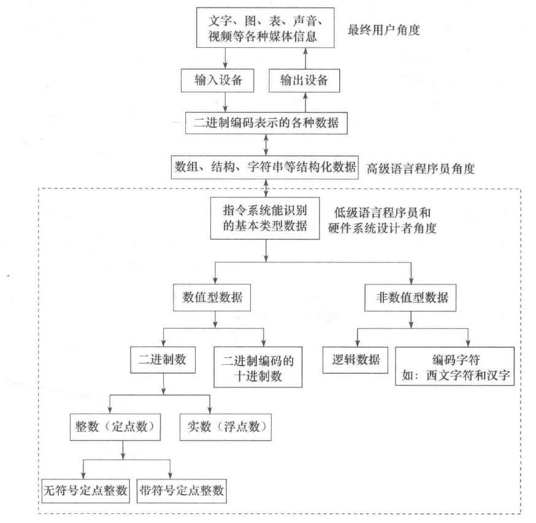
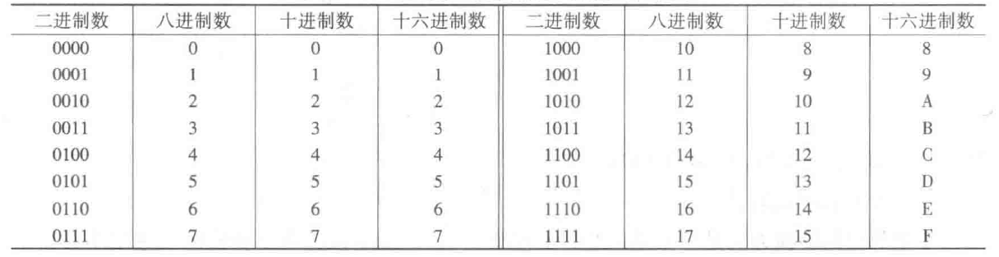
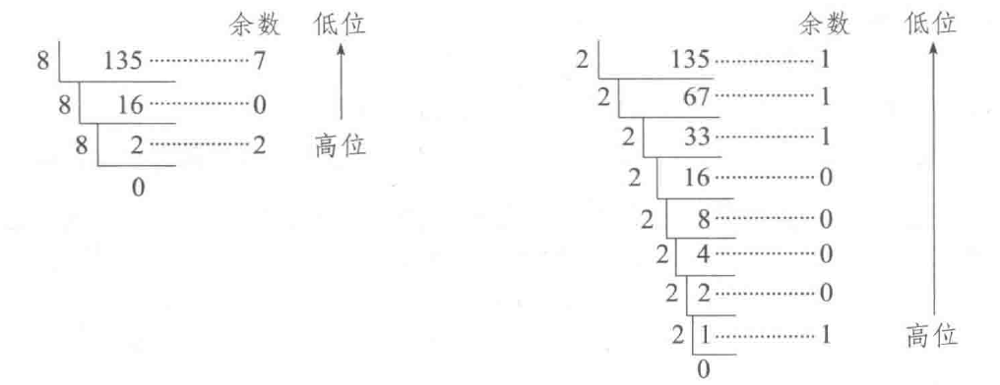
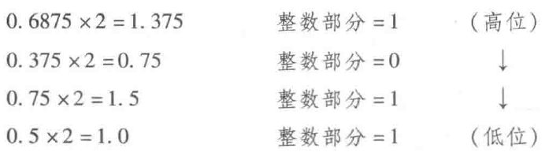
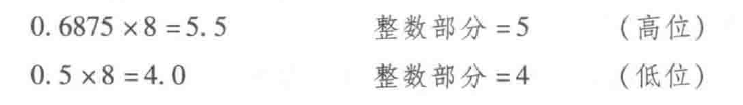
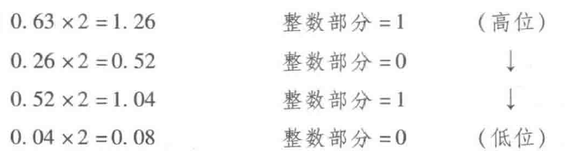

# 信息的二进制编码

在计算机系统内部，所有信息都是用二进制进行编码的。也就是说计算机内部采用的是二进制表示方式。这样做的原因有以下几点:
- 二进制只有两种基本状态，使用有两个稳定状态的物理器件就可以表示二进制数的每一位，而制造有两个稳定状态的物理器件要比制造有多个稳定状态的物理器件容易得多。例如，用高、低两个电位，或用脉冲的有无、脉冲的正负极性等都可以很方便、很可靠地表示“0”和“1”
- 二进制的编码、计数和运算规则都很简单，可用开关电路实现，简便易行
- 两个符号“1”和“0”正好与逻辑命题的两个值“真”和“假”相对应，为计算机中实现逻辑运算和程序中的逻辑判断提供了便利的条件，特别是能通过逻辑门电路方便地实现算术运算

采用二进制编码将各种媒体信息转变成数字化信息后，可以在计算机内部进行存储、运算和传送。在高级语言程序设计中，可以利用图、树、表和队列等数据结构进行算法描述，并以数组、结构、指针和字符串等数据类型来说明处理对象，但将高级语言程序转换为机器语言程序后，每条机器指令的操作数就只能是以下4种简单的基本数据类型：无符号定点整数、带符号定点整数、浮点数和非数值型数据(位串):

指令所处理的数据类型分为数值数据和非数值数据两种。数值数据可用来表示数量的多少，可比较其大小，分为整数和实数，整数又分为无符号整数和带符号整数。在计算机内部，整数用定点数表示，实数用浮点数表示。非数值数据就是一个没有大小之分的位串，不表示数量的多少，主要用来表示字符数据和逻辑数据。

在计算机内部，数值数据的表示方法有两大类：第一种是直接用二进制数表示；另一种是采用二进制编码的十进制数(Binary Coded Decimal Number，简称BCD)表示。表示一个数值数据要确定三个要素：进位计数制、定/浮点表示和编码规则。任何给定的一个二进制 0/1 序列，在未确定它采用什么进位计数制、定点还是浮点表示以及编码表示方法之前，它所代表的数值数据的值是无法确定的。

# 进位计数制
十进制数，其每个数位可用10个不同符号0，1，2，...，9来表示，每个符号处在十进制数中不同位置时，所代表的数值不一样。例如，2585.62代表的值是：

$$
(2585.62)_{10} = 2 \times 10^3 + 5 \times 10^2 + 8 \times 10^1 + 5 \times 10^0 + 6 \times 10^{-1} + 2 \times 10^{-2}
$$

类似地，二进制数的基数是 2，只使用两个不同的数字符号 0 和 1，运算时采用“逢二进一”的规则，例如，二进制数 $(100101.01)_2$ 代表的值是:

$$
(100101.01)_2 = 1 \times 2^5 + 0 \times 2^4 + 0 \times 2^3 + 1 \times 2^2 + 0 \times 2^1 + 1 \times 2^0 + 0 \times 2^{-1} + 1 \times 2^{-2} = (37.25)_{10}
$$

扩展到一般情况，在 R 进制数字系统中，应采用R个基本符号 (0, 1, ..., R-1) 表示各位上的数字，采用“逢R进一”的运算规则，对于每一个数位，该位上的权为 $R^i$。R 被称为该数字系统的基:

- 二进制R=2，基本符号为 0 和 1
- 八进制R=8，基本符号为 0, 1, 2, 3, 4, 5, 6, 7
- 十进制R=10，基本符号为 0, 1, 2, 3, 4, 5, 6, 7, 8, 9
- 十六进制R=10，基本符号为 0, 1, 2, 3, 4, 5, 6, 7, 8, 9, A, B, C, D, E, F

一般用 B(Binary) 表示二进制，用 O(Octal) 表示八进制，用 D(Decimal) 表示十进制(十进制数的后缀可以省略)，而 H(Hexadecimal) 则是十六进制数的后缀，有时也在一个十六进制数之前用 0x 作为前缀，例如二进制数 10011B，十进制数 56D 或 56，十六进制数 308FH 或 0x308F 等。

## 十进制数转换成 R 进制数

十进制数转换成R进制数 任何一个十进制数转换成R进制数时，要将整数和小数部分分别进行转换:

- 整数部分的转换 

整数部分的转换方法是“除基取余，上右下左”。也就是说，用要转换的十进制整数去除以基数 R，将得到的余数作为结果数据中各位的数字，直到上商为0为止。上面的余数(先得到的余数)作为右边低位上的数位，下面的余数作为左边高位上的数位:

例如将 10 进制数 135 转换成 8 进制和 2 进制的过程:

所以:

$$
(135)_10=(207)_8=(10000111)_2
$$

- 小数部分的转换
小数部分的转换方法是“乘基取整，上左下右”。也就是说，用要转换的十进制小数去乘以基数 R，将得到的乘积的整数部分作为结果数据中各位的数字，小数部分继续与基数R相乘。以此类推，直到某一步乘积的小数部分为 0 或已得到希望的位数为止。最后，将上面的整数部分作为左边高位上的数位，下面的整数部分作为右边低位上的数位。

例如将 10 进制小数 0.6875 转换成 2 进制和 8 进制的过程:

所以:
$$
(0.6875)_10 = (0.1011)_2=(0.54)_8
$$

在转换过程中，可能乘积的小数部分总得不到 0，即转换得到希望的位数后还有余数，这种情况下得到的是近似值，例如转换 10 进制小数 0.63:

所以:
$$
(0.63)_10=(0.1010...)_2
$$

- 含整数、小数部分的数的转换

只要将整数部分和小数部分分别进行转换，得到转换后相应的整数和小数部分，然后再将这两部分组合起来得到一个完整的数，例如将十进制数135.6875 分别转换成二进制数和八进制数:
$$
(135.6875)_10=(10000111.1011)_2=(207.54)_8
$$

## 二、八、十六进制数的相互转换

