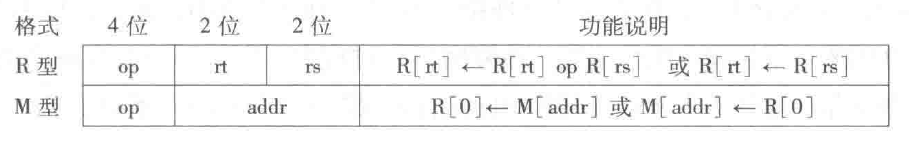
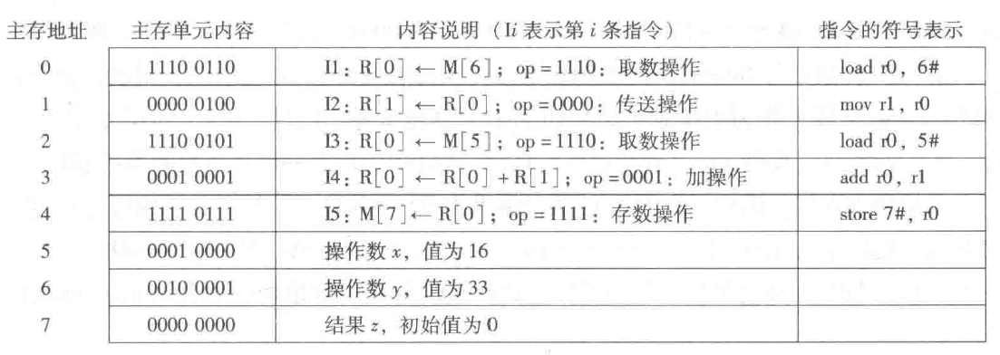
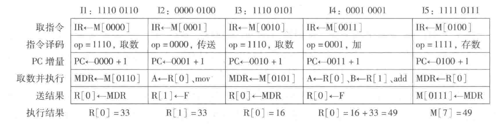

## 冯·诺依曼结构核心特点

冯·诺依曼结构的核心特点:

- 采用“存储程序”工作方式
- 计算机由运算器、控制器、存储器、输入设备和输出设备5个基本部件组成
- 存储器不仅能存放数据，也能存放指令，形式上数据和指令没有区别，但计算机应能区分它们；控制器应能自动执行指令：运算器应能进行算术运算，也能进行逻辑运算；操作人员可以通过输入/输出设备使用计算机
- 计算机内部以二进制形式表示指令和数据：每条指令由操作码和地址码两部分组成，操作码指出操作类型，地址码指出操作数的地址；由一串指令组成程序

## 冯·诺依曼结构基本结构
根据冯·诺依曼结构制作的模型机可以表示为：

模型机中主要包括:

- 用来存放指令和数据的主存储器，简称主存或内存
- 用来进行算术逻辑运算的部件，即算术逻辑部件(Arithmetic Logic Unit，简称 ALU)，在 ALU 操作控制信号 ALUop 的控制下，ALU 可以对输入端 A 和 B 进行不同的运算，得到结果 F
- 用于自动逐条取出指令并进行译码的部件，即控制部件(Control Unit，简称 CU)，也称控制器
- 用来和用户交互的输入设备和输出设备
- 为了临时存放从主存取来的数据或运算的结果，还需要若干通用寄存器(General Purpose Register)，组成通用寄存器组(GPRs)，ALU 两个输入端 A 和 B 的数据来自通用寄存器
- ALU 运算的结果会产生标志信息，例如，结果是否为 0(零标志ZF)、是否为负数(符号标志SF)等，这些标志信息需要记录在专门的标志寄存器中
- 从主存取来的指令需要临时保存在指令寄存器(Instruction Register，简称IR)中
- CPU为了自动按序读取主存中的指令，还需要有一个程序计数器(Program Counter，简称 PC)，在执行当前指令过程中，自动计算出下一条指令的地址并送到 PC 中保存
- 通常把控制部件、运算部件和各类寄存器互连组成的电路称为中央处理器(Central Processing Unit，简称 CPU)，简称处理器
- CPU 需要从通用寄存器中取数据到 ALU 运算，或把 ALU 运算的结果保存到通用寄存器中，因此，需要给每个通用寄存器编号；同样，主存中每个单元也需要编号，称为主存单元地址，简称主存地址。通用寄存器和主存都属于存储部件，通常，计算机中的存储部件从 0 开始编号
- CPU 为了从主存取指令和存取数据，需要通过传输介质与主存相连，通常把连接不同部件进行信息传输的介质称为总线，其中，包含了用于传输地址信息、数据信息和控制信息的地址线、数据线和控制线。CPU访问主存时，需先将主存地址、读/写命令分别送到总线的地址线、控制线，然后通过数据线发送或接收数据。CPU 送到地址线的主存地址应先存放在主存地址寄存器(Memory Address Register，简称 MAR)中，发送到或从数据线取来的信息存放在主存数据寄存器(Memory Data Register，简称 MDR)中。

## 程序和指令的执行过程

- 指令(instruction)是用0和1表示的一串0/1序列，用来指示CPU完成一个特定的原子操作。例如:
    - 取数指令(load)从主存单元中取出数据存放到通用寄存器中
    - 存数指令(store)将通用寄存器的内容写入主存单元
    - 加法指令(add)将两个通用寄存器内容相加后送入结果寄存器
    - 传送指令(mov)将一个通用寄存器的内容送到另一个通用寄存器

- 指令通常被划分为若干个字段，有操作码、地址码等字段。操作码字段指出指令的操作类型，如取数、存数、加、减、传送、跳转等；地址码字段指出指令所处理的操作数的地址，如寄存器编号、主存单元编号等

假设上面的模型机:

- 字长为 8 位
- 有 4 个通用寄存器 r0～r3，编号分别为 0～3
- 有 16 个主存单元，编号为 0~15
- 每个主存单元和 CPU 中的 ALU、通用寄存器、IR、MDR 的宽度都是 8 位
- PC 和 MAR 的宽度都是 4 位
- 连接 CPU 和主存的总线中有 4 位地址线、8 位数据线和若干位控制线(包括读/写命令线)
- 采用 8 位定长指令字，即每条指令有 8 位。指令格式有 R 型和 M 型两种

- op 为操作码字段:
    - R 型指令:
        - 0000: 寄存器间传送(mov) 操作
        - 0001: 加 (add) 操作
    - M 型指令:
        - 1110: 取数(load) 操作
        - 1111: 存数(store) 操作
- rs 和 rt 为通用寄存器编号，R[r] 表示编号为 r 的通用寄存器中的内容
- addr 为主存单元地址，[addr] 表示地址为 addr 的主存单元内容
- "←" 表示从右向左传送数据

若在该模型机上实现 $z=x+y$，$x$ 和 $y$ 分别存放在主存 5 号和 6 号单元中，结果 $z$ 存放在 7 号单元中，则执行过程可以表示为:

“存储程序”工作方式规定: 程序执行前，需将程序包含的指令和数据先送入主存，一旦启动程序执行，则计算机必须能够在不需操作人员干预下自动完成逐条指令取出和执行的任务。一个程序的执行就是周而复始地执行一条一条指令的过程。每条指令的执行过程包括:

- 从主存取指令
- 对指令进行译码
- PC增量
- 取操作数并执行
- 将结果送主存或寄存器保存。

程序执行前，首先将程序的起始地址存放在 PC 中，取指令时，将 PC 的内容作为地址访问主存。每条指令执行过程中，都需要计算下条将执行指令的主存地址，并送到 PC 中。若当前指令是转移指令，则PC的内容将根据转移指令的要求进行修改:

- 若当前指令为顺序型指令，则下条指令地址为 PC 的内容加上当前指令的长度
- 若当前指令为跳转型指令，则下条指令地址为指令中指定的目标地址

当前指令执行完后，根据 PC 的值到主存中取到的是下条将要执行的指令，因而计算机能够周而复始地自动取出并执行一条一条指令。

根据上述规则，则 $z=x+y$ 执行过程中，程序首地址(即指令 I1 所在地址)为 0，因此，程序开始执行时，PC 的内容为 0000。根据程序执行流程，该程序运行过程中，所执行的指令顺序为 I1→I2→I3→I4→I5:

指令 I1 的过程如下:

- 指令 I1 存放在第 0 单元，故取指令操作为 IR←M[0000]，表示将主存 0 单元中的内容取到指令寄存器 IR 中，故取指令阶段结束时，IR 中内容为11100110
- 将高 4 位 1110(op字段)送到控制部件进行指令译码；同时控制 PC 进行 "+1" 操作，PC 中内容变为 0001
- 因为是取数指令，所以控制器产生"主存读"控制信号 Read，同时控制在取数并执行阶段将 Read 信号送控制线、指令后 4 位的 0110(addr字段)作为主存地址送 MAR 并自动送地址线，经过一段时间以后，主存将 0110(6#)单元中的33(变量)送到数据线并自动存储在 MDR 中
- 最后由控制器控制将 MDR 内容送 0 号通用寄存器，因此，指令 1 的执行结果为 R[0]=33

指令执行各阶段都包含若干个微操作，微操作需要相应的控制信号(control signal)进行控制:

- 取指令阶段 IR←M[PC] 微操作有：MAR←PC；控制线 Read；IR←MDR
- 取数阶段 R[0]←M[addr] 微操作有：MAR←addr；控制线 Read；R[0]←MDR
- 存数阶段 M[addr]←R[0] 微操作有：MAR←addr；MDR←R[0]；控制线 Write
- ALU 运算 R[0]←R[0]+R[1] 微操作有：A←R[0]；B←R[1]；ALUop←add；F←ALU

ALU 操作有加 (add)、减(sub)、与(and)、或(or)、传送(mov) 等类型，ALU 操作控制信号 ALUop 可以控制 ALU 进行不同的运算。例如，ALUop←mov时，ALU 的输出 F=A；ALUop←add 时，ALU 的输出 F=A+B。

这里的 Read、Write、mov、add 等微操作控制信号都是控制部件对 op 字段进行译码后送出的，每条指令执行过程中，所包含的微操作具有先后顺序关系，需要定时信号进行定时。通常，CPU中所有微操作都由时钟信号进行定时，时钟信号(clock signal)的宽度为一个时钟周期(clock cycle)。一条指令的执行时间包含一个或多个时钟周期。

## 冯·诺依曼体系结构的改进
冯·诺依曼结构得到了持续的改进，主要包括：
- 由以运算器为中心改进为以存储器为中心。使数据的流向更加合理，从而使运算器、存储器和输入输出设备能够并行工作
- 由单一的集中控制改进为分散控制。计算机发展初期，工作速度很低，运算器、存储器、控制器和输入输出设备可以在同一个时钟信号的控制下同步工作。现在运算器、内存与输入输出设备的速度差异很大，需要采用异步方式分散控制
- 从基于串行算法改进为适应并行算法。出现了流水线处理器、超标量处理器、向量处理器、多核处理器、对称多处理器(Symmetric Multiprocessor，简称SMP)、大规模并行处理机(Massively Parallel Processing，简称MPP)和机群系统等
- 出现为适应特殊需要的专用计算机，如图形处理器(Graphic Processing Unit，简称GPU)、数字信号处理器(Digital Signal Processor，简称DSP)等

## 哈佛结构

哈佛结构把程序和数据分开存储，控制器使用两条独立的总线读取程序和访问数据，程序空间和数据空间完成分开
- 在嵌入式应用中，系统要执行的任务相对单一，程序一般是固化在硬件里的，同时嵌入式系统对安全性、可靠性的要求更高，哈佛结构独立的程序空间更有利于代码保护。因此，在嵌入式领域，哈佛结构得到了广泛应用
- 哈佛结构并没有改变冯·诺依曼结构存储程序和指令驱动执行的本质，它只是冯·诺依曼结构的一个变种，并不是独立于冯·诺依曼结构的一种新型结构