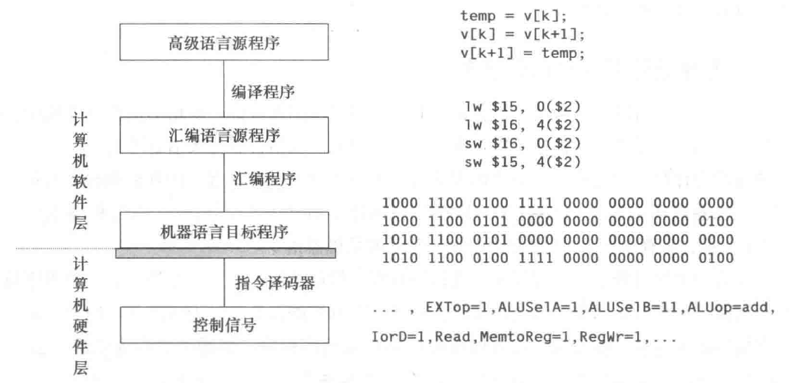
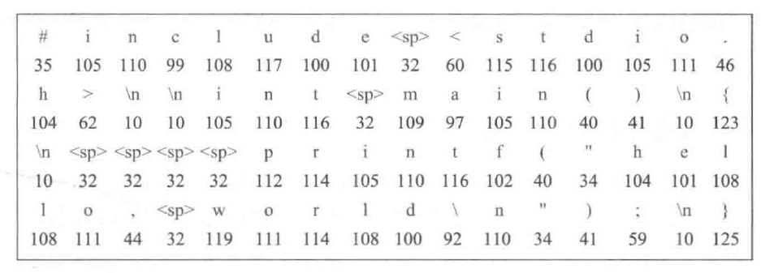
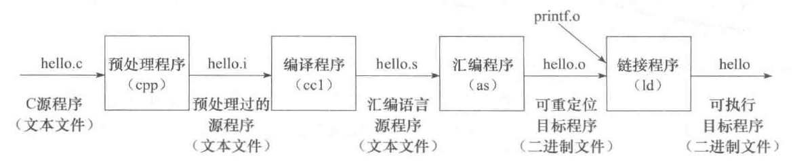

# 程序设计语言和翻译程序

从抽象层次上来分，可以分成高级语言和低级语言两类:

低级语言主要包含:

- 机器语言: 使用特定计算机规定的指令格式而形成的 0/1 序列称为机器语言，计算机能理解和执行的程序称为机器代码或机器语言程序，其中的每条指令都由 0 和 1 组成，称为机器指令
- 汇编语言: 机器语言程序的可读性很差，也不易记忆，给程序员的编写和阅读带来极大的困难。因此，人们创造了一种机器语言的符号表示语言，用简短的英文符号和机器指令建立对应关系，以方便程序员编写和阅读程序。这种语言称为汇编语言(assembly language)，机器指令对应的符号表示称为汇编指令，但是，因为计算机无法理解和执行汇编指令，所以用汇编语言编写的汇编语言源程序必须先转换为机器语言程序，才能被计算机执行

每条汇编指令表示的功能与对应机器指令一样，汇编指令和机器指令都与特定的机器结构相关，因此，汇编语言和机器语言都属于低级语言，它们统称为机器级语言。因为每条指令的功能非常简单，所以使用机器级语言描述程序功能时，需描述的细节很多，不仅程序设计工作效率很低，而且同一个程序不能在不同机器上运行。为此，程序员多采用高级程序设计语言编写程序。

高级编程语言，是指面向算法设计的、较接近于日常英语书面语言的程序设计语言，如 BASIC、C、C++、Fortran、Java 等，它与具体的机器结构无关，可读性比机器级语言好，描述能力更强，一条语句可对应多条或数十条指令。


不过，因为计算机无法直接理解和执行高级编程语言程序，所以需要将高级编程语言程序转换成机器语言程序。因为这个转换过程是计算机自动完成的，所以把进行这种转换的软件统称为翻译程序(translator)。

被翻译的语言和程序分别称为源语言和源程序，翻译生成的语言和程序分别称为目标语言和目标程序。翻译程序有以下三类:

- 汇编程序(assembler)：也称汇编器，实现将汇编语言源程序翻译成机器语言目标程序
- 解释程序(interpreter)：也称解释器，实现将源程序中的语句按其执行顺序逐条翻译成机器指令并立即执行
- 编译程序(compiler)：也称编译器，实现将高级语言源程序翻译成汇编语言或机器语言目标程序

例如交换数组中的连续两个元素的代码转换过程，可以表示为:



# 从源程序到可执行文件
`hello.c` 文件:

```
#include<stdio.h>

int main()
{
    printf("hello,world\n");
    return 0;
}
```

`hello.c` 在计算机中以 ASCII 字符方式存放，通常把用 ASCII 码字符或汉字字符表示的文件称为文本文件(text file)，源程序文件都是文本文件，是可显示和可读的:



将 `hello.c` 进行预处理、编译、汇编和链接，最终生成可执行目标文件。例如，在 UNIX 系统中，可用 GCC 编译驱动程序进行处理，命令如下:

```
gcc -o hello hello.c
```



- 预处理阶段: 预处理程序(cpp)对源程序中以字符 `#` 开头的命令进行处理，例如，将 `#include` 命令后面的 `.h` 文件内容嵌入到源程序文件中。预处理程序的输出结果还是一个源程序文件，以 `.i` 为扩展名
- 编译阶段: 编译程序(cc1)对预处理后的源程序进行编译，生成一个汇编语言源程序文件，以 `.s` 为扩展名，因为汇编语言与具体的机器结构有关，所以，对同一台机器来说，不管何种高级语言，编译转换后的输出结果都是同一种机器语言对应的汇编语言源程序
- 汇编阶段: 汇编程序(as)对汇编语言源程序进行汇编，生成一个可重定位目标文件(relocatable object file)，以 `.o` 为扩展名，因为其中的代码已经是机器指令，数据以及其他信息也都是用二进制表示的，所以它是不可读的，也即打开显示出来的是乱码
- 链接阶段: 链接程序(ld)将多个可重定位目标文件和标准函数库中的可重定位目标文件合并成为一个可执行目标文件(executable object file)，可执行目标文件简称为可执行文件，本例中，链接器将 `hello.o` 和标准库函数 `printf` 所在的可重定位目标模块 `printf.o` 进行合并，生成可执行文件`hello`
- 最终生成的可执行文件被保存在磁盘上，可以通过某种方式启动一个磁盘上的可执行文件运行。


# 可执行文件的启动执行
在 UNIX 系统中，可以通过 shell 命令行解释器来执行一个可执行文件:
```
./hello

# 输出
hello,world
```
在输入命令后用户需按下 Enter 键表示结束之后计算机的执行过程为:

- 1、shell 程序会将用户从键盘输入的每个字符逐一读入 CPU 寄存器中
- 2、然后将寄存器中的字符再保存到主存储器中，在主存的缓冲区形成字符串 "/hello"
- 3、等到接收到 Enter 按键时 shell 将调出操作系统内核中相应的服务例程，由内核来加载磁盘上的可执行文件 hello 到存储器
- 4、内核加载完可执行文件中的代码及其所要处理的数据(这里是字符串"hello，world\n")后，将 hello 第一条指令的地址送到程序计数器(PC)中，CPU 永远都是将 PC 的内容作为将要执行的指令的地址，因此，处理器随后开始执行 hello 程序，它将加载到主存的字符串 "hello，world\n" 中的每一个字符从主存取到 CPU 的寄存器中
- 5、最后将 CPU 寄存器中的字符送到显示器上显示出来


从上述过程可以看出，一个用户程序被启动执行，必须依靠操作系统的支持，包括提供人机接口环境(如外壳程序)和内核服务例程:

- shell 命令行解释器是操作系统外壳程序，它为用户提供了一个启动程序执行的环境，用来对用户从键盘输入的命令进行解释，并调出操作系统内核来加载用户程序(用户从键盘输入的命令所对应的程序)
- 用来加载用户程序并使其从第一条指令开始执行的操作系统内核服务例程也是必不可少的
- 在上述过程中，涉及键盘、磁盘和显示器等外部设备的操作，这些底层硬件是不能由用户程序直接访问的。此时，也需要依靠操作系统内核服务例程的支持，例如:
    - 用户程序需要调用内核的 read 系统调用服务例程读取磁盘文件
    - 调用内核的 write 系统调用服务例程把字符串“写”到显示器等

键盘、磁盘和显示器等外部设备简称为外设，也称为 I/O 设备，其中，I/O 是输入/输出(Input/Output)的缩写。外设通常由机械部分和电子部分组成，并且两部分通常是可以分开的。机械部分是外部设备本身，而电子部分则是控制外部设备工作的 I/O 控制器或 I/O 适配器。外设通过 I/O 控制器或 I/O 适配器连接到主机上，I/O 控制器或 I/O 适配器统称为设备控制器。

各种设备的 I/O 控制器或适配器都是一种 I/O 模块，解决各个外设和主机之间的同步与协调、工作速度的匹配和数据格式的转换等问题，通常，I/O 模块中有数据缓冲寄存器、命令字寄存器和状态字寄存器，它们统称为 I/O 端口。为了能够访问这些端口，需要对其进行编址，所有 I/O 端口的地址组成的空间称为 I/O 空间。I/O 空间可以和主存空间统一编址，也可以单独编址，前者称为存储器映射方式，后者称为独立编址方式。