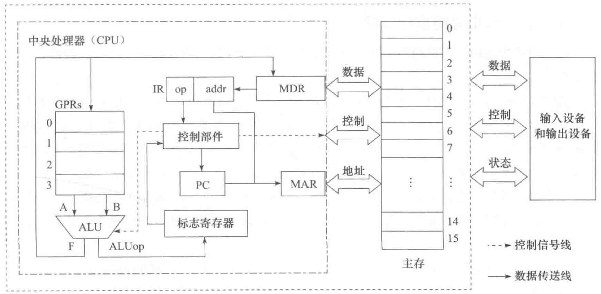
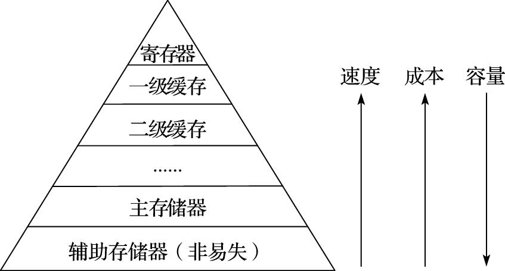

# 冯·诺依曼结构

冯·诺依曼结构的核心特点:
- 采用“存储程序”工作方式。
- 计算机由运算器、控制器、存储器、输入设备和输出设备5个基本部件组成
- 存储器不仅能存放数据，也能存放指令，形式上数据和指令没有区别，但计算机应能区分它们；控制器应能自动执行指令：运算器应能进行算术运算，也能进行逻辑运算；操作人员可以通过输入/输出设备使用计算机
- 计算机内部以二进制形式表示指令和数据：每条指令由操作码和地址码两部分组成，操作码指出操作类型，地址码指出操作数的地址；由一串指令组成程序

根据冯·诺依曼结构制作的模型机可以表示为：

模型机中主要包括:
- 用来存放指令和数据的主存储器，简称主存或内存
- 用来进行算术逻辑运算的部件，即算术逻辑部件(Arithmetic Logic Unit，简称 ALU)，在 ALU 操作控制信号 ALUop 的控制下，ALU 可以对输入端 A 和 B 进行不同的运算，得到结果 F
- 用于自动逐条取出指令并进行译码的部件，即控制部件(Control Unit，简称 CU)，也称控制器
- 用来和用户交互的输入设备和输出设备
- 为了临时存放从主存取来的数据或运算的结果，还需要若干通用寄存器(General Purpose Register)，组成通用寄存器组(GPRs)，ALU 两个输入端 A 和 B 的数据来自通用寄存器
- ALU 运算的结果会产生标志信息，例如，结果是否为 0(零标志ZF)、是否为负数(符号标志SF)等，这些标志信息需要记录在专门的标志寄存器中
- 从主存取来的指令需要临时保存在指令寄存器(Instruction Register，简称IR)中
- CPU为了自动按序读取主存中的指令，还需要有一个程序计数器(Program Counter，简称 PC)，在执行当前指令过程中，自动计算出下一条指令的地址并送到 PC 中保存
- 通常把控制部件、运算部件和各类寄存器互连组成的电路称为中央处理器（Central Processing Unit，简称 CPU），简称处理器

CPU 需要从通用寄存器中取数据到 ALU 运算，或把 ALU 运算的结果保存到通用寄存器中，因此，需要给每个通用寄存器编号；同样，主存中每个单元也需要编号，称为主存单元地址，简称主存地址。通用寄存器和主存都属于存储部件，通常，计算机中的存储部件从 0 开始编号。

CPU为了从主存取指令和存取数据，需要通过传输介质与主存相连，通常把连接不同部件进行信息传输的介质称为总线，其中，包含了用于传输地址信息、数据信息和控制信息的地址线、数据线和控制线。CPU访问主存时，需先将主存地址、读/写命令分别送到总线的地址线、控制线，然后通过数据线发送或接收数据。CPU送到地址线的主存地址应先存放在主存地址寄存器（Memory Address Register，简称MAR）中，发送到或从数据线取来的信息存放在主存数据寄存器（Memory Data Register，简称MDR）中。

## 冯·诺依曼体系结构的改进
冯·诺依曼结构得到了持续的改进，主要包括：
- 由以运算器为中心改进为以存储器为中心。使数据的流向更加合理，从而使运算器、存储器和输入输出设备能够并行工作
- 由单一的集中控制改进为分散控制。计算机发展初期，工作速度很低，运算器、存储器、控制器和输入输出设备可以在同一个时钟信号的控制下同步工作。现在运算器、内存与输入输出设备的速度差异很大，需要采用异步方式分散控制
- 从基于串行算法改进为适应并行算法。出现了流水线处理器、超标量处理器、向量处理器、多核处理器、对称多处理器（Symmetric Multiprocessor，简称SMP）、大规模并行处理机（Massively Parallel Processing，简称MPP）和机群系统等
- 出现为适应特殊需要的专用计算机，如图形处理器（Graphic Processing Unit，简称GPU）、数字信号处理器（Digital Signal Processor，简称DSP）等

## 哈佛结构

哈佛结构把程序和数据分开存储，控制器使用两条独立的总线读取程序和访问数据，程序空间和数据空间完成分开
- 在嵌入式应用中，系统要执行的任务相对单一，程序一般是固化在硬件里的，同时嵌入式系统对安全性、可靠性的要求更高，哈佛结构独立的程序空间更有利于代码保护。因此，在嵌入式领域，哈佛结构得到了广泛应用
- 哈佛结构并没有改变冯·诺依曼结构存储程序和指令驱动执行的本质，它只是冯·诺依曼结构的一个变种，并不是独立于冯·诺依曼结构的一种新型结构

# 计算机组成部件

## 运算器
运算器是计算机中负责计算（包括算术计算、逻辑计算、附加计算等）的部件。运算器包括算术和逻辑运算部件（Arithmetic Logic Units，简称ALU）、移位部件、浮点运算部件（Floating Point Units，简称FPU）、向量运算部件、寄存器等。
- 复杂运算如乘除法、开方及浮点运算可用程序实现或由运算器实现
- 寄存器既可用于保存数据，也可用于保存地址
- 运算器还可设置条件码寄存器等专用寄存器，条件码寄存器保存当前运算结果的状态，如运算结果是正数、负数或零，是否溢出等

## 控制器
控制器是计算机中发出控制命令以控制计算机各部件自动、协调地工作的装置。
- 控制器控制指令流和每条指令的执行，内含程序计数器和指令寄存器等：
    - 程序计数器存放当前执行指令的地址
    - 指令寄存器存放当前正在执行的指令
- 指令通过译码产生控制信号，用于控制运算器、存储器、IO设备的工作以及后续指令的获取
- 控制器还产生一定频率的时钟脉冲，用于计算机各组成部分的同步

由于控制器和运算器的紧密耦合关系，现代计算机通常把控制器和运算器集成在一起，称为中央处理器，即CPU。现代CPU除了含有运算器和控制器外，常常还集成了其他部件，比如高速缓存（Cache）部件、内存控制器等。

计算机执行指令一般包含以下过程：从存储器取指令并对取回的指令进行译码，从存储器或寄存器读取指令执行需要的操作数，执行指令，把执行结果写回存储器或寄存器。上述过程称为一个指令周期。计算机不断重复指令周期直到完成程序的执行。体系结构研究的一个永恒主题就是不断加速上述指令执行周期，从而提高计算机运行程序的效率。

现代处理器的控制器都通过指令流水线技术来提高指令执行效率:
- 指令流水线把一条指令的执行划分为若干阶段，例如：取指、译码、执行、访存、写回阶段来减少每个时钟周期的工作量，从而提高主频
- 允许多条指令的不同阶段重叠执行实现并行处理（如一条指令处于执行阶段时，另一条指令处于译码阶段）。虽然同一条指令的执行时间没有变短，但处理器在单位时间内执行的指令数增加了

### 提高 CPU 流水线效率的相关技术

#### 转移预测技术
冯·诺依曼结构指令驱动执行的特点，典型应用程序平均每5-10条指令中就有一条转移指令，而转移指令的后续指令需要等待转移指令执行结果确定后才能取指，导致转移指令和后续指令之间不能重叠执行，降低了流水线效率。随着主频的提高，现代处理器流水线普遍在10-20级之间，由于转移指令引起的流水线阻塞成为提高指令流水线效率的重要瓶颈。

转移预测技术可以消除转移指令引起的指令流水线阻塞。转移预测器根据当前转移指令或其他转移指令的历史行为，在转移指令的取指或译码阶段预测该转移指令的跳转方向和目标地址并进行后续指令的取指。转移指令执行后，根据已经确定的跳转方向和目标地址对预测结果进行修正。如果发生转移预测错误，还需要取消指令流水线中的后续指令。为了提高预测精度并降低预测错误时的流水线开销，现代高性能处理器采用了复杂的转移预测器。

#### 乱序执行技术
如果指令i是条长延迟指令，如除法指令或Cache不命中的访存指令，那么在顺序指令流水线中指令i后面的指令需要在流水线中等待很长时间。乱序执行技术通过指令动态调度允许指令i后面的源操作数准备好的指令越过指令i执行（需要使用指令i的运算结果的指令由于源操作数没有准备好，不会越过指令i执行），以提高指令流水线效率。为此，在指令译码之后的读寄存器阶段，应判断指令需要的操作数是否准备好：
- 如果操作数已经准备好，就进入执行阶段
- 如果操作数没有准备好，就进入称为保留站或者发射队列的队列中等待，直到操作数准备好后再进入执行阶段
为了保证执行结果符合程序规定的要求，乱序执行的指令需要有序结束。为此，执行完的指令均进入一个称为重排序缓冲（Re-Order Buffer，简称ROB）的队列，并把执行结果临时写入重命名寄存器。ROB根据指令进入流水线的次序，有序提交指令的执行结果到目标寄存器或存储器。

就像保留站和重排序缓冲用来临时存储指令以使指令在流水线中流动更加通畅，重命名寄存器用来临时存储数据以使数据在流水线流动更加通畅。保留站、重排序缓冲、重命名寄存器都是微结构中的数据结构，程序员无法用指令来访问，是结构设计人员为了提高流水线效率而用来临时存储指令和数据的：
- 保留站把指令从有序变为无序以提高执行效率
- 重排序缓存把指令从无序重新变为有序以保证正确性
- 重命名寄存器则在乱序执行过程中临时存储数据
重命名寄存器与指令可以访问的结构寄存器（如通用寄存器、浮点寄存器）相对应。乱序执行流水线把指令执行结果写入重命名寄存器而不是结构寄存器，以避免破坏结构寄存器的内容，到顺序提交阶段再把重命名寄存器内容写入结构寄存器。两组执行不同运算但使用同一结构寄存器的指令可以使用不同的重命名寄存器，从而避免该结构寄存器成为串行化瓶颈，实现并行执行。

#### 超标量技术
超标量结构允许指令流水线的每一阶段同时处理多条指令。例如:Alpha 21264处理器每拍可以取4条指令，发射6条指令，写回6条指令，提交11条指令。如果把单发射结构比作单车道马路，多发射结构就是多车道马路。

由于超标量结构的指令和数据通路都变宽了，使得寄存器端口、保留站端口、ROB端口、功能部件数都需要增加，现代超标量处理器一般包含两个以上访存部件，两个以上定点运算部件以及两个以上浮点运算部件。超标量结构在指令译码或寄存器重命名时不仅要判断前后拍指令的数据相关，还需要判断同一拍中多条指令间的数据相关。

## 存储器
存储器存储程序和数据，又称主存储器或内存，一般用动态随机访问存储器（Dynamic Random Access Memory，简称DRAM）实现。CPU可以直接访问它，IO设备也频繁地与它交换数据。

存储器的存取速度往往满足不了CPU的快速要求，容量也满足不了应用的需要，为此将存储系统分为高速缓存（Cache)、主存储器和辅助存储器三个层次:
- Cache存放当前CPU最频繁访问的部分主存储器内容，可以采用比DRAM速度快但容量小的静态随机访问存储器（Static Random Access Memory，简称SRAM）实现
- 数据和指令在Cache和主存储器之间的调动由硬件自动完成。为扩大存储器容量，使用磁盘、磁带、光盘等能存储大量数据的存储器作为辅助存储器。计算机运行时所需的应用程序、系统软件和数据等都先存放在辅助存储器中，在运行过程中分批调入主存储器。数据和指令在主存储器和辅助存储器之间的调动由操作系统完成
- CPU访问存储器时，面对的是一个高速（接近于Cache的速度）、大容量（接近于辅助存储器的容量）的存储器

现代计算机中还有少量只读存储器（Read Only Memory，简称ROM）用来存放引导程序和基本输入输出系统（Basic Input Output System，简称BIOS）等。

现代计算机访问内存时采用虚拟地址，操作系统负责维护虚拟地址和物理地址转换的页表，集成在CPU中的存储管理部件（Memory Management Unit，简称MMU）负责把虚拟地址转换为物理地址。

存储器的主要评价指标为存储容量和访问速度。存储容量越大，可以存放的程序和数据越多。访问速度越快，处理器访问的时间越短。对相同容量的存储器，速度越快的存储介质成本越高，而成本越低的存储介质则速度越低:
- 磁性存储介质。如硬盘、磁带等，特点是存储密度高、成本低、具有非易失性（断电后数据可长期保存），缺点是访问速度慢。磁带的访问速度在秒级，磁盘的访问速度一般在毫秒级
- 闪存（Flash Memory）。同样是非易失性的存储介质，与磁盘相比，它们的访问速度快，成本高，容量小
- 动态随机访问存储器（DRAM）。属于易失性存储器（断电后数据丢失）。特点是存储密度较高（存储一位数据只需一个晶体管），需要周期性刷新，访问速度较快。其访问速度一般在几十纳秒级
- 静态随机访问存储器（SRAM）。属于易失性存储器（断电后数据丢失）。存储密度不如DRAM高（SRAM存储一位数据需要4-8个晶体管），不用周期性刷新，但访问速度比DRAM快，可以达到纳秒级，小容量时能够和处理器核工作在相同的时钟频率

现代计算机中把上述不同的存储介质组成存储层次，以在成本合适的情况下降低存储访问延迟:
- 越往上的层级，速度越快，但成本越高，容量越小
- 越往下的层级，速度越慢，但成本越低，容量越大

存储层次的有效性，依赖于程序的访存局部性原理，包含两个方面：
- 一是时间局部性，指的是如果一个数据被访问，那么在短时间内很有可能被再次访问
- 二是空间局部性，指的是如果一个数据被访问，那么它的邻近数据也很有可能被访问

利用局部性原理，可以把程序近期可能用到的数据存放在靠上的层次，把近期内不会用到的数据存放在靠下的层次。通过恰当地控制数据在层次间的移动，使处理器需要访问的数据尽可能地出现在靠近处理器的存储层次，可以大大提高处理器获得数据的速度，从而近似达到用最快的存储器构建一个容量很大的单级存储的效果。

