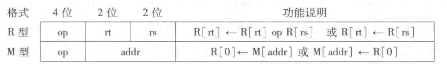
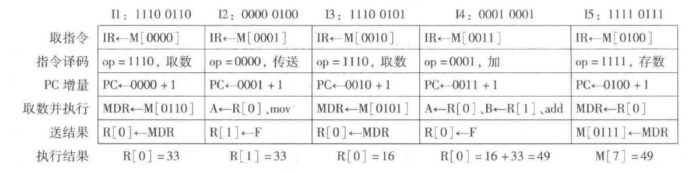
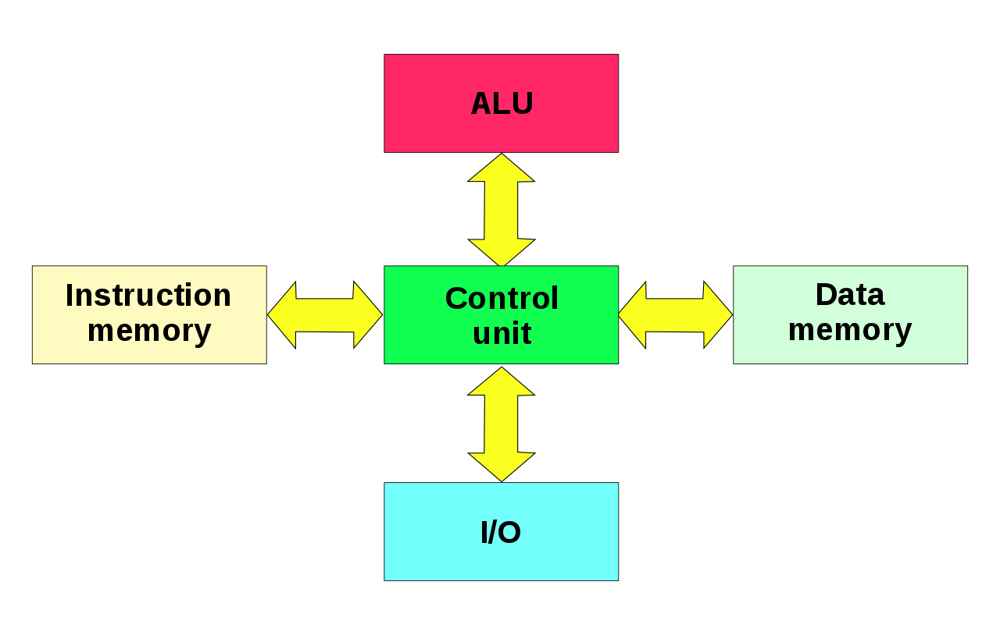
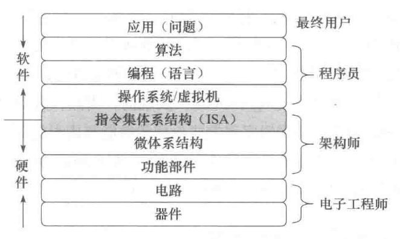

# 冯·诺依曼结构

## 冯·诺依曼结构核心特点

冯·诺依曼结构的核心特点:

- 采用“存储程序”工作方式
- 计算机由运算器、控制器、存储器、输入设备和输出设备5个基本部件组成
- 存储器不仅能存放数据，也能存放指令，形式上数据和指令没有区别，但计算机应能区分它们；控制器应能自动执行指令：运算器应能进行算术运算，也能进行逻辑运算；操作人员可以通过输入/输出设备使用计算机
- 计算机内部以二进制形式表示指令和数据：每条指令由操作码和地址码两部分组成，操作码指出操作类型，地址码指出操作数的地址；由一串指令组成程序

## 冯·诺依曼结构基本结构
根据冯·诺依曼结构制作的模型机可以表示为：


模型机中主要包括:

- 用来存放指令和数据的主存储器，简称主存或内存
- 用来进行算术逻辑运算的部件，即算术逻辑部件(Arithmetic Logic Unit，简称 ALU)，在 ALU 操作控制信号 ALUop 的控制下，ALU 可以对输入端 A 和 B 进行不同的运算，得到结果 F
- 用于自动逐条取出指令并进行译码的部件，即控制部件(Control Unit，简称 CU)，也称控制器
- 用来和用户交互的输入设备和输出设备
- 为了临时存放从主存取来的数据或运算的结果，还需要若干通用寄存器(General Purpose Register)，组成通用寄存器组(GPRs)，ALU 两个输入端 A 和 B 的数据来自通用寄存器
- ALU 运算的结果会产生标志信息，例如，结果是否为 0(零标志ZF)、是否为负数(符号标志SF)等，这些标志信息需要记录在专门的标志寄存器中
- 从主存取来的指令需要临时保存在指令寄存器(Instruction Register，简称IR)中
- CPU为了自动按序读取主存中的指令，还需要有一个程序计数器(Program Counter，简称 PC)，在执行当前指令过程中，自动计算出下一条指令的地址并送到 PC 中保存
- 通常把控制部件、运算部件和各类寄存器互连组成的电路称为中央处理器(Central Processing Unit，简称 CPU)，简称处理器
- CPU 需要从通用寄存器中取数据到 ALU 运算，或把 ALU 运算的结果保存到通用寄存器中，因此，需要给每个通用寄存器编号；同样，主存中每个单元也需要编号，称为主存单元地址，简称主存地址。通用寄存器和主存都属于存储部件，通常，计算机中的存储部件从 0 开始编号
- CPU 为了从主存取指令和存取数据，需要通过传输介质与主存相连，通常把连接不同部件进行信息传输的介质称为总线，其中，包含了用于传输地址信息、数据信息和控制信息的地址线、数据线和控制线。CPU访问主存时，需先将主存地址、读/写命令分别送到总线的地址线、控制线，然后通过数据线发送或接收数据。CPU 送到地址线的主存地址应先存放在主存地址寄存器(Memory Address Register，简称 MAR)中，发送到或从数据线取来的信息存放在主存数据寄存器(Memory Data Register，简称 MDR)中。

## 程序和指令的执行过程

- 指令(instruction)是用0和1表示的一串0/1序列，用来指示CPU完成一个特定的原子操作。例如:
    - 取数指令(load)从主存单元中取出数据存放到通用寄存器中
    - 存数指令(store)将通用寄存器的内容写入主存单元
    - 加法指令(add)将两个通用寄存器内容相加后送入结果寄存器
    - 传送指令(mov)将一个通用寄存器的内容送到另一个通用寄存器

- 指令通常被划分为若干个字段，有操作码、地址码等字段。操作码字段指出指令的操作类型，如取数、存数、加、减、传送、跳转等；地址码字段指出指令所处理的操作数的地址，如寄存器编号、主存单元编号等

假设上面的模型机:

- 字长为 8 位
- 有 4 个通用寄存器 r0～r3，编号分别为 0～3
- 有 16 个主存单元，编号为 0~15
- 每个主存单元和 CPU 中的 ALU、通用寄存器、IR、MDR 的宽度都是 8 位
- PC 和 MAR 的宽度都是 4 位
- 连接 CPU 和主存的总线中有 4 位地址线、8 位数据线和若干位控制线(包括读/写命令线)
- 采用 8 位定长指令字，即每条指令有 8 位。指令格式有 R 型和 M 型两种



- op 为操作码字段:
    - R 型指令:
        - 0000: 寄存器间传送(mov) 操作
        - 0001: 加 (add) 操作
    - M 型指令:
        - 1110: 取数(load) 操作
        - 1111: 存数(store) 操作
- rs 和 rt 为通用寄存器编号，R[r] 表示编号为 r 的通用寄存器中的内容
- addr 为主存单元地址，[addr] 表示地址为 addr 的主存单元内容
- "←" 表示从右向左传送数据

若在该模型机上实现 $z=x+y$，$x$ 和 $y$ 分别存放在主存 5 号和 6 号单元中，结果 $z$ 存放在 7 号单元中，则执行过程可以表示为:


“存储程序”工作方式规定: 程序执行前，需将程序包含的指令和数据先送入主存，一旦启动程序执行，则计算机必须能够在不需操作人员干预下自动完成逐条指令取出和执行的任务。一个程序的执行就是周而复始地执行一条一条指令的过程。每条指令的执行过程包括:

- 从主存取指令
- 对指令进行译码
- PC增量
- 取操作数并执行
- 将结果送主存或寄存器保存。

程序执行前，首先将程序的起始地址存放在 PC 中，取指令时，将 PC 的内容作为地址访问主存。每条指令执行过程中，都需要计算下条将执行指令的主存地址，并送到 PC 中。若当前指令是转移指令，则PC的内容将根据转移指令的要求进行修改:

- 若当前指令为顺序型指令，则下条指令地址为 PC 的内容加上当前指令的长度
- 若当前指令为跳转型指令，则下条指令地址为指令中指定的目标地址

当前指令执行完后，根据 PC 的值到主存中取到的是下条将要执行的指令，因而计算机能够周而复始地自动取出并执行一条一条指令。

根据上述规则，则 $z=x+y$ 执行过程中，程序首地址(即指令 I1 所在地址)为 0，因此，程序开始执行时，PC 的内容为 0000。根据程序执行流程，该程序运行过程中，所执行的指令顺序为 I1→I2→I3→I4→I5:




指令 I1 的过程如下:

- 指令 I1 存放在第 0 单元，故取指令操作为 IR←M[0000]，表示将主存 0 单元中的内容取到指令寄存器 IR 中，故取指令阶段结束时，IR 中内容为11100110
- 将高 4 位 1110(op字段)送到控制部件进行指令译码；同时控制 PC 进行 "+1" 操作，PC 中内容变为 0001
- 因为是取数指令，所以控制器产生"主存读"控制信号 Read，同时控制在取数并执行阶段将 Read 信号送控制线、指令后 4 位的 0110(addr字段)作为主存地址送 MAR 并自动送地址线，经过一段时间以后，主存将 0110(6#)单元中的33(变量)送到数据线并自动存储在 MDR 中
- 最后由控制器控制将 MDR 内容送 0 号通用寄存器，因此，指令 1 的执行结果为 R[0]=33


指令执行各阶段都包含若干个微操作，微操作需要相应的控制信号(control signal)进行控制:

- 取指令阶段 IR←M[PC] 微操作有：MAR←PC；控制线 Read；IR←MDR
- 取数阶段 R[0]←M[addr] 微操作有：MAR←addr；控制线 Read；R[0]←MDR
- 存数阶段 M[addr]←R[0] 微操作有：MAR←addr；MDR←R[0]；控制线 Write
- ALU 运算 R[0]←R[0]+R[1] 微操作有：A←R[0]；B←R[1]；ALUop←add；F←ALU

ALU 操作有加 (add)、减(sub)、与(and)、或(or)、传送(mov) 等类型，ALU 操作控制信号 ALUop 可以控制 ALU 进行不同的运算。例如，ALUop←mov时，ALU 的输出 F=A；ALUop←add 时，ALU 的输出 F=A+B。

这里的 Read、Write、mov、add 等微操作控制信号都是控制部件对 op 字段进行译码后送出的，每条指令执行过程中，所包含的微操作具有先后顺序关系，需要定时信号进行定时。通常，CPU中所有微操作都由时钟信号进行定时，时钟信号(clock signal)的宽度为一个时钟周期(clock cycle)。一条指令的执行时间包含一个或多个时钟周期。


## 冯·诺依曼体系结构的改进
冯·诺依曼结构得到了持续的改进，主要包括：
- 由以运算器为中心改进为以存储器为中心。使数据的流向更加合理，从而使运算器、存储器和输入输出设备能够并行工作
- 由单一的集中控制改进为分散控制。计算机发展初期，工作速度很低，运算器、存储器、控制器和输入输出设备可以在同一个时钟信号的控制下同步工作。现在运算器、内存与输入输出设备的速度差异很大，需要采用异步方式分散控制
- 从基于串行算法改进为适应并行算法。出现了流水线处理器、超标量处理器、向量处理器、多核处理器、对称多处理器(Symmetric Multiprocessor，简称SMP)、大规模并行处理机(Massively Parallel Processing，简称MPP)和机群系统等
- 出现为适应特殊需要的专用计算机，如图形处理器(Graphic Processing Unit，简称GPU)、数字信号处理器(Digital Signal Processor，简称DSP)等

## 哈佛结构


哈佛结构把程序和数据分开存储，控制器使用两条独立的总线读取程序和访问数据，程序空间和数据空间完成分开
- 在嵌入式应用中，系统要执行的任务相对单一，程序一般是固化在硬件里的，同时嵌入式系统对安全性、可靠性的要求更高，哈佛结构独立的程序空间更有利于代码保护。因此，在嵌入式领域，哈佛结构得到了广泛应用
- 哈佛结构并没有改变冯·诺依曼结构存储程序和指令驱动执行的本质，它只是冯·诺依曼结构的一个变种，并不是独立于冯·诺依曼结构的一种新型结构


# 程序的开发与运行

## 程序设计语言和翻译程序

从抽象层次上来分，可以分成高级语言和低级语言两类:

低级语言主要包含:

- 机器语言: 使用特定计算机规定的指令格式而形成的 0/1 序列称为机器语言，计算机能理解和执行的程序称为机器代码或机器语言程序，其中的每条指令都由 0 和 1 组成，称为机器指令
- 汇编语言: 机器语言程序的可读性很差，也不易记忆，给程序员的编写和阅读带来极大的困难。因此，人们创造了一种机器语言的符号表示语言，用简短的英文符号和机器指令建立对应关系，以方便程序员编写和阅读程序。这种语言称为汇编语言(assembly language)，机器指令对应的符号表示称为汇编指令，但是，因为计算机无法理解和执行汇编指令，所以用汇编语言编写的汇编语言源程序必须先转换为机器语言程序，才能被计算机执行

每条汇编指令表示的功能与对应机器指令一样，汇编指令和机器指令都与特定的机器结构相关，因此，汇编语言和机器语言都属于低级语言，它们统称为机器级语言。因为每条指令的功能非常简单，所以使用机器级语言描述程序功能时，需描述的细节很多，不仅程序设计工作效率很低，而且同一个程序不能在不同机器上运行。为此，程序员多采用高级程序设计语言编写程序。

高级编程语言，是指面向算法设计的、较接近于日常英语书面语言的程序设计语言，如 BASIC、C、C++、Fortran、Java 等，它与具体的机器结构无关，可读性比机器级语言好，描述能力更强，一条语句可对应多条或数十条指令。


不过，因为计算机无法直接理解和执行高级编程语言程序，所以需要将高级编程语言程序转换成机器语言程序。因为这个转换过程是计算机自动完成的，所以把进行这种转换的软件统称为翻译程序(translator)。

被翻译的语言和程序分别称为源语言和源程序，翻译生成的语言和程序分别称为目标语言和目标程序。翻译程序有以下三类:

- 汇编程序(assembler)：也称汇编器，实现将汇编语言源程序翻译成机器语言目标程序
- 解释程序(interpreter)：也称解释器，实现将源程序中的语句按其执行顺序逐条翻译成机器指令并立即执行
- 编译程序(compiler)：也称编译器，实现将高级语言源程序翻译成汇编语言或机器语言目标程序

例如交换数组中的连续两个元素的代码转换过程，可以表示为:


## 从源程序到可执行文件
`hello.c` 文件:

```
#include<stdio.h>

int main()
{
    printf("hello,world\n");
    return 0;
}
```

`hello.c` 在计算机中以 ASCII 字符方式存放，通常把用 ASCII 码字符或汉字字符表示的文件称为文本文件(text file)，源程序文件都是文本文件，是可显示和可读的:


将 `hello.c` 进行预处理、编译、汇编和链接，最终生成可执行目标文件。例如，在 UNIX 系统中，可用 GCC 编译驱动程序进行处理，命令如下:

```
gcc -o hello hello.c
```


- 预处理阶段: 预处理程序(cpp)对源程序中以字符 `#` 开头的命令进行处理，例如，将 `#include` 命令后面的 `.h` 文件内容嵌入到源程序文件中。预处理程序的输出结果还是一个源程序文件，以 `.i` 为扩展名
- 编译阶段: 编译程序(cc1)对预处理后的源程序进行编译，生成一个汇编语言源程序文件，以 `.s` 为扩展名，因为汇编语言与具体的机器结构有关，所以，对同一台机器来说，不管何种高级语言，编译转换后的输出结果都是同一种机器语言对应的汇编语言源程序
- 汇编阶段: 汇编程序(as)对汇编语言源程序进行汇编，生成一个可重定位目标文件(relocatable object file)，以 `.o` 为扩展名，因为其中的代码已经是机器指令，数据以及其他信息也都是用二进制表示的，所以它是不可读的，也即打开显示出来的是乱码
- 链接阶段: 链接程序(ld)将多个可重定位目标文件和标准函数库中的可重定位目标文件合并成为一个可执行目标文件(executable object file)，可执行目标文件简称为可执行文件，本例中，链接器将 `hello.o` 和标准库函数 `printf` 所在的可重定位目标模块 `printf.o` 进行合并，生成可执行文件`hello`
- 最终生成的可执行文件被保存在磁盘上，可以通过某种方式启动一个磁盘上的可执行文件运行。


## 可执行文件的启动执行
在 UNIX 系统中，可以通过 shell 命令行解释器来执行一个可执行文件:
```
./hello

# 输出
hello,world
```
在输入命令后用户需按下 Enter 键表示结束之后计算机的执行过程为:

- 1、shell 程序会将用户从键盘输入的每个字符逐一读入 CPU 寄存器中
- 2、然后将寄存器中的字符再保存到主存储器中，在主存的缓冲区形成字符串 "/hello"
- 3、等到接收到 Enter 按键时 shell 将调出操作系统内核中相应的服务例程，由内核来加载磁盘上的可执行文件 hello 到存储器
- 4、内核加载完可执行文件中的代码及其所要处理的数据(这里是字符串"hello，world\n")后，将 hello 第一条指令的地址送到程序计数器(PC)中，CPU 永远都是将 PC 的内容作为将要执行的指令的地址，因此，处理器随后开始执行 hello 程序，它将加载到主存的字符串 "hello，world\n" 中的每一个字符从主存取到 CPU 的寄存器中
- 5、最后将 CPU 寄存器中的字符送到显示器上显示出来


从上述过程可以看出，一个用户程序被启动执行，必须依靠操作系统的支持，包括提供人机接口环境(如外壳程序)和内核服务例程:

- shell 命令行解释器是操作系统外壳程序，它为用户提供了一个启动程序执行的环境，用来对用户从键盘输入的命令进行解释，并调出操作系统内核来加载用户程序(用户从键盘输入的命令所对应的程序)
- 用来加载用户程序并使其从第一条指令开始执行的操作系统内核服务例程也是必不可少的
- 在上述过程中，涉及键盘、磁盘和显示器等外部设备的操作，这些底层硬件是不能由用户程序直接访问的。此时，也需要依靠操作系统内核服务例程的支持，例如:
    - 用户程序需要调用内核的 read 系统调用服务例程读取磁盘文件
    - 调用内核的 write 系统调用服务例程把字符串“写”到显示器等

键盘、磁盘和显示器等外部设备简称为外设，也称为 I/O 设备，其中，I/O 是输入/输出(Input/Output)的缩写。外设通常由机械部分和电子部分组成，并且两部分通常是可以分开的。机械部分是外部设备本身，而电子部分则是控制外部设备工作的 I/O 控制器或 I/O 适配器。外设通过 I/O 控制器或 I/O 适配器连接到主机上，I/O 控制器或 I/O 适配器统称为设备控制器。

各种设备的 I/O 控制器或适配器都是一种 I/O 模块，解决各个外设和主机之间的同步与协调、工作速度的匹配和数据格式的转换等问题，通常，I/O 模块中有数据缓冲寄存器、命令字寄存器和状态字寄存器，它们统称为 I/O 端口。为了能够访问这些端口，需要对其进行编址，所有 I/O 端口的地址组成的空间称为 I/O 空间。I/O 空间可以和主存空间统一编址，也可以单独编址，前者称为存储器映射方式，后者称为独立编址方式。

# 计算机系统的层次结构

## 计算机系统抽象层的转换

计算机硬件只能理解机器语言。要将一个自然语言描述的应用问题转换为机器语言程序，需要经过应用问题描述、算法抽象、高级语言程序设计、将高级语言源程序转换为特定机器语言目标程序等多个抽象层的转换。



机器语言程序所运行的计算机硬件和软件之间需要有一个“桥梁”，这个在软件和硬件之间的界面就是指令集体系结构(Instruction Set Architecture，简称ISA)，简称体系结构或系统结构(architecture)，它是软件和硬件之间接口的一个完整定义。ISA 定义了一台计算机可以执行的所有指令的集合，每条指令规定了计算机执行什么操作，以及所处理的操作数存放的地址空间和操作数类型。ISA 规定的内容包括:

- 数据类型及格式
- 指令格式
- 寻址方式和可访问地址空间大小
- 程序可访问的通用寄存器的个数、位数和编号
- 控制寄存器的定义
- I/O空间的编址方式
- 中断结构
- 机器工作状态的定义和切换
- 输入/输出结构和数据传送方式
- 存储保护方式

机器语言程序就是一个 ISA 规定的指令的序列，因此，计算机硬件执行机器语言程序的过程就是让其执行一条一条指令的过程。ISA 是对指令系统的一种规定或结构规范，具体实现的组织(organization)称为微体系结构(microarchitecture)，简称微架构。ISA 和微体系结构是两个不同层面上的概念。微体系结构是软件不可感知的部分，例如，加法器采用串行进位方式还是并行进位方式实现属于微体系结构。相同的 ISA 可能具有不同的微体系结构，例如，对于 Intel x86 这种 ISA，很多处理器的组织方式不同，也即具有不同的微架构，但因为它们具有相同的 ISA，所以一种处理器上运行的程序，在另一种处理器上也能运行。

微体系结构最终是由逻辑电路(logic circuit)实现的，当然，微架构中的一个功能部件可以用不同的逻辑来实现，用不同的逻辑实现方式得到的性能和成本是有差异的。


## 计算机系统核心层之间的关联
高级编程语言的翻译程序将高级语言源程序转换为机器级目标代码，或者转换为机器代码并直接执行，这个过程需要完成多个步骤，包括词法分析、语法分析、语义分析、中间代码生成、代码优化、目标代码生成和目标代码优化等。整个过程可划分为前端和后端两个阶段：

- 通常把中间代码生成及之前各步骤称为前端，前端主要完成对源程序的分析，把源程序切分成一些基本块，并生成中间语言表示
- 后端在分析结果正确无误的基础上，把中间语言表示(中间代码)转化为目标机器支持的机器级语言程序

翻译程序的后端应根据ISA规范和应用程序二进制接口(Application Binary Interface，简称 ABI)规范进行设计实现。

- 因为翻译程序的后端将生成在目标机器中能够运行的机器目标代码，所以，它必须按照目标机器的ISA规范生成相应的机器目标代码。对于不符合 ISA 规范的目标代码，将无法正确运行在根据该 ISA 规范而设计的计算机上
- ABI 是为运行在特定 ISA 及特定操作系统之上的应用程序规定的一种机器级目标代码层接口，包含了运行在特定 ISA 及特定操作系统之上的应用程序所对应的目标代码生成时必须遵循的约定。不符合 ABI 规范的目标程序，将无法正确运行在根据该ABI规范提供的操作系统运行环境中。ABI 描述了应用程序和操作系统之间、应用程序和所调用的库之间、不同组成部分(如进程或函数)之间在较低层次上的机器级代码接口：例如
    - 过程之间的调用约定(如参数和返回值如何传递等)
    - 系统调用约定(系统调用的参数和调用号如何传递以及如何从用户态陷入操作系统内核等)
    - 目标文件的二进制格式和函数库使用约定
    - 机器中寄存器的使用规定
    - 程序的虚拟地址空间划分等

- 在 ISA 层之上，操作系统向应用程序提供的运行时环境需要符合 ABI 规范，同时，操作系统也需要根据 ISA 规范来使用硬件提供的接口，包括硬件提供的各种控制寄存器和状态寄存器、原子操作、中断机制、分段和分页存储管理部件等。如果操作系统没有按照 ISA 规范使用硬件接口，则无法提供操作系统的重要功能
- 在 ISA 层之下，处理器设计时需要根据 ISA 规范来设计相应的硬件接口供操作系统和应用程序使用，不符合 ISA 规范的处理器设计，将无法支撑操作系统和应用程序的正确运行

# 计算机系统性能评价

## 计算机性能的定义

吞吐率(throughput)和响应时间(response time)是考量一个计算机系统性能的两个基本指标:

- 吞吐率表示在单位时间内所完成的工作量，类似的概念是带宽(bandwidth)，它表示单位时间内所传输的信息量
- 响应时间是指从作业提交开始到作业完成所用的时间，类似的概念是执行时间(execution time)和等待时间(latency)，它们都是用来表示一个任务所用时间的度量值

## 计算机性能的测试

操作系统在对处理器进行调度时，一段时间内往往会让多个程序(更准确地说是进程)轮流使用处理器，因此在某个用户程序执行过程中，可能同时还会有其他用户程序和操作系统程序在执行，所以，通常情况下，一个程序的执行时间除了程序包含的指令在CPU上执行所用的时间外，还包括磁盘访问时间、输入输出操作所需时间以及操作系统运行这个程序所用的额外开销等，也即，用户感觉到的某个程序的执行时间并不是其真正的执行时间。通常把用户感觉到的执行时间分成以下两部分CPU 时间和其他时间:

- CPU 时间: CPU 时间指 CPU 用于本程序执行的时间，它又包括以下两部分：
    - 用户 CPU 时间，指真正用于运行用户程序代码的时间
    - 系统CPU时间，指为了执行用户程序而需要CPU运行操作系统程序的时间
- 其他时间: 指等待 I/O 操作完成的时间或 CPU 用于执行其他用户程序的时间

计算机系统的性能评价主要考虑的是 CPU 性能。系统性能和 CPU 性能并不等价，两者有一些区别。系统性能是指系统的响应时间，它与 CPU 外的其他部分也有关系；而 CPU 性能是指用户 CPU 时间，它只包含 CPU 运行用户程序代码的时间。

在对 CPU 时间进行计算时需要用到以下几个重要的概念和指标:

- 时钟周期：计算机执行一条指令的过程被分成若干步骤(微操作)来完成，每一步都要有相应的控制信号进行控制，这些控制信号何时发出、作用时间多长，都要有相应的定时信号进行同步。因此，计算机必须能够产生同步的时钟定时信号，也就是 CPU 的主脉冲信号，其宽度称为时钟周期
- 时钟频率：CPU 的主频就是 CPU 中的主脉冲信号的时钟频率(clock rate)，是 CPU 时钟周期的倒数
- CPI：CPI(Cycles Per Instruction)表示执行一条指令所需的时钟周期数。由于不同指令的功能不同，所需的时钟周期数也不同:
    - 对于一条特定指令而言，其 CPI 指执行该条指令所需的时钟周期数，此时CPI是一个确定的值
    - 对于一个程序或一台机器来说，其 CPI 指该程序或该机器指令集中的所有指令执行所需的平均时钟周期数，此时，CPI 是一个平均值

已知上述参数或指标，可以通过以下公式来计算用户程序的CPU执行时间，即用户CPU时间:

```
用户CPU时间 = 程序总时钟周期数 / 时钟频率 = 程序总时钟周期数 × 时钟周期
```

程序总时钟周期数可由程序总指令条数和相应的 CPI 求得:
```
程序总时钟周期数 = 程序总指令条数 × CPI
```

若已知程序综合 CPI 和总指令条数，则可用下列公式计算用户 CPU 时间:
```
用户CPU时间 = CPI × 程序总指令条数 × 时钟周期
```

用户 CPU 时间度量公式中的时钟周期、指令条数、CPI 三个因素是相互制约的。例如，更改指令集可以减少程序总指令条数，但是，同时可能引起 CPU 结构的调整，从而可能会增加时钟周期的宽度(即降低时钟频率)。对于解决同一个问题的不同程序，即使是在同一台计算机上，指令条数最少的程序也不一定执行得最快。


## 使用指令执行速度进行性能评估

指令速度所用的计量单位为 MIPS(Million Instructions Per Second)，其含义是平均每秒执行多少百万条指令。

设某类指令在程序中所占比例为 w1，执行时间为 t1，则等效指令的执行时间为：$T = w1t1 + w2t2 + ... + wn*tn$，(n 为指令种类数)，若指令执行时间用时钟周期数来衡量的话，则上式计算的结果就是 CPI。对指令平均执行时间求倒数能够得到 MIPS 值。选取一组指令组合，使得得到的平均 CPI 最小，由此得到的 MIPS 就是峰值 MIPS(peak MIPS)。有些制造商经常将峰值 MIPS 直接当作 MIPS，而实际上的性能要比标称的性能差。

MIPS 反映的是机器定点运算执行的速度。浮点操作速度的指标是 MFLOPS(Million FLOating-point operations Per Second)或 Mflop/s。它表示每秒所执行的浮点运算有多少百万(10^6)次，它是基于所完成的操作次数而不是指令数来衡量的。类似的浮点操作速度还有 GFLOPS 或 Gflop/s(10^9)、TFLOPS或 Tflop/s(10^12)、PFLOPS 或 Pflop/s(10^15)和 EFLOPS 或 Eflop/s(10^18)等。


