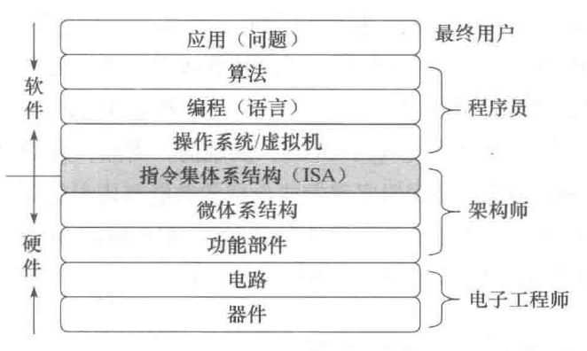

# 计算机系统抽象层的转换

计算机硬件只能理解机器语言。要将一个自然语言描述的应用问题转换为机器语言程序，需要经过应用问题描述、算法抽象、高级语言程序设计、将高级语言源程序转换为特定机器语言目标程序等多个抽象层的转换。

机器语言程序所运行的计算机硬件和软件之间需要有一个“桥梁”，这个在软件和硬件之间的界面就是指令集体系结构(Instruction Set Architecture，简称ISA)，简称体系结构或系统结构(architecture)，它是软件和硬件之间接口的一个完整定义。ISA 定义了一台计算机可以执行的所有指令的集合，每条指令规定了计算机执行什么操作，以及所处理的操作数存放的地址空间和操作数类型。ISA 规定的内容包括:

- 数据类型及格式
- 指令格式
- 寻址方式和可访问地址空间大小
- 程序可访问的通用寄存器的个数、位数和编号
- 控制寄存器的定义
- I/O空间的编址方式
- 中断结构
- 机器工作状态的定义和切换
- 输入/输出结构和数据传送方式
- 存储保护方式

机器语言程序就是一个 ISA 规定的指令的序列，因此，计算机硬件执行机器语言程序的过程就是让其执行一条一条指令的过程。ISA 是对指令系统的一种规定或结构规范，具体实现的组织(organization)称为微体系结构(microarchitecture)，简称微架构。ISA 和微体系结构是两个不同层面上的概念。微体系结构是软件不可感知的部分，例如，加法器采用串行进位方式还是并行进位方式实现属于微体系结构。相同的 ISA 可能具有不同的微体系结构，例如，对于 Intel x86 这种 ISA，很多处理器的组织方式不同，也即具有不同的微架构，但因为它们具有相同的 ISA，所以一种处理器上运行的程序，在另一种处理器上也能运行。

微体系结构最终是由逻辑电路(logic circuit)实现的，当然，微架构中的一个功能部件可以用不同的逻辑来实现，用不同的逻辑实现方式得到的性能和成本是有差异的。

# 计算机系统核心层之间的关联
高级编程语言的翻译程序将高级语言源程序转换为机器级目标代码，或者转换为机器代码并直接执行，这个过程需要完成多个步骤，包括词法分析、语法分析、语义分析、中间代码生成、代码优化、目标代码生成和目标代码优化等。整个过程可划分为前端和后端两个阶段：

- 通常把中间代码生成及之前各步骤称为前端，前端主要完成对源程序的分析，把源程序切分成一些基本块，并生成中间语言表示
- 后端在分析结果正确无误的基础上，把中间语言表示(中间代码)转化为目标机器支持的机器级语言程序

翻译程序的后端应根据ISA规范和应用程序二进制接口(Application Binary Interface，简称 ABI)规范进行设计实现。

- 因为翻译程序的后端将生成在目标机器中能够运行的机器目标代码，所以，它必须按照目标机器的ISA规范生成相应的机器目标代码。对于不符合 ISA 规范的目标代码，将无法正确运行在根据该 ISA 规范而设计的计算机上
- ABI 是为运行在特定 ISA 及特定操作系统之上的应用程序规定的一种机器级目标代码层接口，包含了运行在特定 ISA 及特定操作系统之上的应用程序所对应的目标代码生成时必须遵循的约定。不符合 ABI 规范的目标程序，将无法正确运行在根据该ABI规范提供的操作系统运行环境中。ABI 描述了应用程序和操作系统之间、应用程序和所调用的库之间、不同组成部分(如进程或函数)之间在较低层次上的机器级代码接口：例如
    - 过程之间的调用约定(如参数和返回值如何传递等)
    - 系统调用约定(系统调用的参数和调用号如何传递以及如何从用户态陷入操作系统内核等)
    - 目标文件的二进制格式和函数库使用约定
    - 机器中寄存器的使用规定
    - 程序的虚拟地址空间划分等

- 在 ISA 层之上，操作系统向应用程序提供的运行时环境需要符合 ABI 规范，同时，操作系统也需要根据 ISA 规范来使用硬件提供的接口，包括硬件提供的各种控制寄存器和状态寄存器、原子操作、中断机制、分段和分页存储管理部件等。如果操作系统没有按照 ISA 规范使用硬件接口，则无法提供操作系统的重要功能
- 在 ISA 层之下，处理器设计时需要根据 ISA 规范来设计相应的硬件接口供操作系统和应用程序使用，不符合 ISA 规范的处理器设计，将无法支撑操作系统和应用程序的正确运行