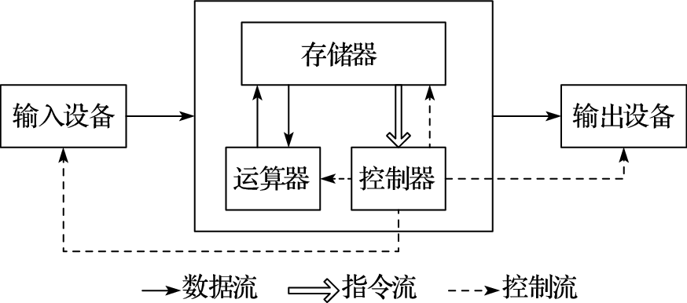
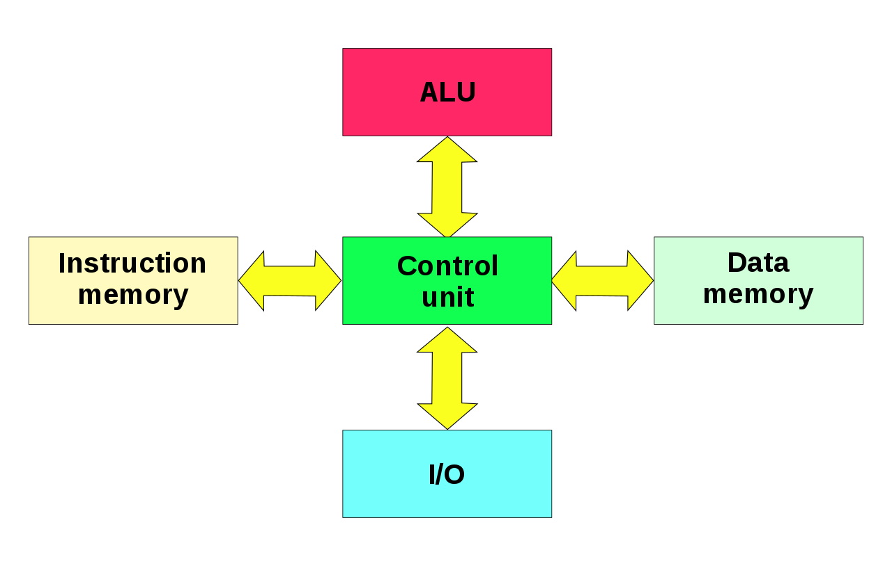

# 计算机组成原理和结构

## 冯·诺依曼结构

- 五大功能部件：运算器、控制器、存储器、输入设备、输出设备，其中运算器和控制器合称为中央处理器（Central Processing Processor，简称CPU）
- 存储器是按地址访问的线性编址的一维结构，每个单元的位数固定
- 采用"存储程序"工作方式
    - 指令和数据不加区别混合存储在同一个存储器中
    - 内部以二进制形式表示指令和数据，每条指令由操作码和地址码两部分组成：操作码指出操作类型，地址码指出操作数的地址
- 控制器通过执行指令发出控制信号控制计算机的操作。指令在存储器中按其执行顺序存放，由指令计数器指明要执行的指令所在的单元地址。指令计数器一般按顺序递增，但执行顺序可按运算结果或当时的外界条件而改变
- 以运算器为中心，输入输出设备与存储器之间的数据传送都经过运算器

### 冯·诺依曼体系结构的改进
冯·诺依曼结构得到了持续的改进，主要包括：
- 由以运算器为中心改进为以存储器为中心。使数据的流向更加合理，从而使运算器、存储器和输入输出设备能够并行工作
- 由单一的集中控制改进为分散控制。计算机发展初期，工作速度很低，运算器、存储器、控制器和输入输出设备可以在同一个时钟信号的控制下同步工作。现在运算器、内存与输入输出设备的速度差异很大，需要采用异步方式分散控制
- 从基于串行算法改进为适应并行算法。出现了流水线处理器、超标量处理器、向量处理器、多核处理器、对称多处理器（Symmetric Multiprocessor，简称SMP）、大规模并行处理机（Massively Parallel Processing，简称MPP）和机群系统等
- 出现为适应特殊需要的专用计算机，如图形处理器（Graphic Processing Unit，简称GPU）、数字信号处理器（Digital Signal Processor，简称DSP）等

### 哈佛结构

哈佛结构把程序和数据分开存储，控制器使用两条独立的总线读取程序和访问数据，程序空间和数据空间完成分开
- 在嵌入式应用中，系统要执行的任务相对单一，程序一般是固化在硬件里的，同时嵌入式系统对安全性、可靠性的要求更高，哈佛结构独立的程序空间更有利于代码保护。因此，在嵌入式领域，哈佛结构得到了广泛应用
- 哈佛结构并没有改变冯·诺依曼结构存储程序和指令驱动执行的本质，它只是冯·诺依曼结构的一个变种，并不是独立于冯·诺依曼结构的一种新型结构

## 计算机组成部件

### 运算器
运算器是计算机中负责计算（包括算术计算、逻辑计算、附加计算等）的部件。运算器包括算术和逻辑运算部件（Arithmetic Logic Units，简称ALU）、移位部件、浮点运算部件（Floating Point Units，简称FPU）、向量运算部件、寄存器等。
- 复杂运算如乘除法、开方及浮点运算可用程序实现或由运算器实现
- 寄存器既可用于保存数据，也可用于保存地址
- 运算器还可设置条件码寄存器等专用寄存器，条件码寄存器保存当前运算结果的状态，如运算结果是正数、负数或零，是否溢出等

### 控制器
控制器是计算机中发出控制命令以控制计算机各部件自动、协调地工作的装置。
- 控制器控制指令流和每条指令的执行，内含程序计数器和指令寄存器等：
    - 程序计数器存放当前执行指令的地址
    - 指令寄存器存放当前正在执行的指令
- 指令通过译码产生控制信号，用于控制运算器、存储器、IO设备的工作以及后续指令的获取
- 控制器还产生一定频率的时钟脉冲，用于计算机各组成部分的同步

由于控制器和运算器的紧密耦合关系，现代计算机通常把控制器和运算器集成在一起，称为中央处理器，即CPU。现代CPU除了含有运算器和控制器外，常常还集成了其他部件，比如高速缓存（Cache）部件、内存控制器等。

计算机执行指令一般包含以下过程：从存储器取指令并对取回的指令进行译码，从存储器或寄存器读取指令执行需要的操作数，执行指令，把执行结果写回存储器或寄存器。上述过程称为一个指令周期。计算机不断重复指令周期直到完成程序的执行。体系结构研究的一个永恒主题就是不断加速上述指令执行周期，从而提高计算机运行程序的效率。

现代处理器的控制器都通过指令流水线技术来提高指令执行效率:
- 指令流水线把一条指令的执行划分为若干阶段，例如：取指、译码、执行、访存、写回阶段来减少每个时钟周期的工作量，从而提高主频
- 允许多条指令的不同阶段重叠执行实现并行处理（如一条指令处于执行阶段时，另一条指令处于译码阶段）。虽然同一条指令的执行时间没有变短，但处理器在单位时间内执行的指令数增加了

#### 提高 CPU 流水线效率的相关技术

##### 转移预测技术

